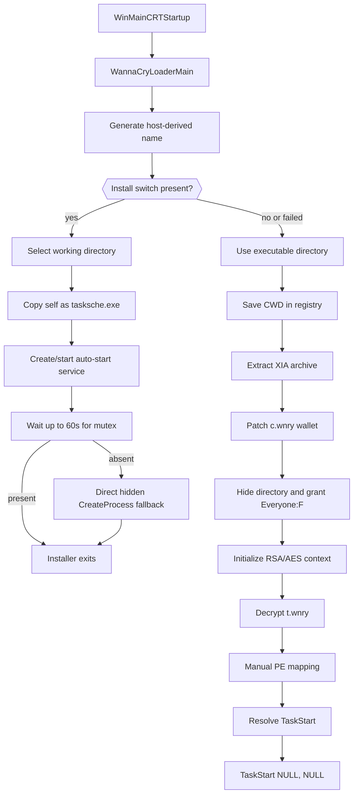

# WannaCry Core Loader — Static Reverse-Engineering Analysis

## Scope

This document covers the **core x86 loader/installer** represented by the sample:

`ed01ebfbc9eb5bbea545af4d01bf5f1071661840480439c6e5babe8e080e41aa`

The work was performed statically. The sample was not executed. The package does not contain the original executable or any extracted executable payloads.

The analysis is complete for the currently examined outer loader. The inner `TaskStart` payload from `t.wnry`, `u.wnry`, `taskdl.exe`, and `taskse.exe` remain separate follow-on targets.

## Executive summary

The sample is a 32-bit Windows GUI PE produced with the Microsoft Visual C++ 6-era toolchain. It is not protected by a conventional executable packer. Instead, most of its file size and entropy come from a password-protected ZIP stored in a custom PE resource named `XIA`.

The loader:

1. Generates a deterministic service/directory name from the victim hostname.
2. Handles an installation branch that copies itself as `tasksche.exe` into a selected hidden working directory.
3. Creates or starts an automatic Windows service whose binary path is `cmd.exe /c "<full path to tasksche.exe>"`.
4. Uses a global mutex as a synchronization signal and falls back to direct process creation when service launch does not produce the mutex.
5. Extracts a 36-entry encrypted archive from resource `XIA/2058/1033` with password `WNcry@2ol7`.
6. Preserves an existing `c.wnry` across re-extraction, then writes one of three Bitcoin addresses into its wallet field.
7. Saves the active working directory in `HKLM` or `HKCU` under `Software\\WanaCrypt0r`, value `wd`.
8. Hides the working directory and grants `Everyone:F` recursively.
9. Parses and decrypts `t.wnry`, which contains a `WANACRY!` wrapper around an RSA-protected symmetric key and encrypted PE data.
10. Maps the decrypted PE manually in memory, resolves the export `TaskStart`, and calls it as `TaskStart(NULL, NULL)`.

## Sample identity

| Field | Value |
|---|---|
| Type | PE32 GUI executable, Intel i386 |
| File size | 3,514,368 bytes (`0x35A000`) |
| MD5 | `84c82835a5d21bbcf75a61706d8ab549` |
| SHA-1 | `5ff465afaabcbf0150d1a3ab2c2e74f3a4426467` |
| SHA-256 | `ed01ebfbc9eb5bbea545af4d01bf5f1071661840480439c6e5babe8e080e41aa` |
| SHA-512 | `90723a50c20ba3643d625595fd6be8dcf88d70ff7f4b4719a88f055d5b3149a4231018ea30d375171507a147e59f73478c0c27948590794554d031e7d54b7244` |
| Imphash | `68f013d7437aa653a8a98a05807afeb1` |
| Shannon entropy | `7.995471` bits/byte |
| Compiler/toolchain indication | Microsoft Visual C/C++ 12.00.9782 / Visual Studio 6.0-era runtime |
| Linker | Microsoft Linker 6.00.8047 |
| Fake version metadata | Microsoft DiskPart, Windows 7 SP1 version strings |

## PE section layout

| Section | RVA | Raw offset | Virtual size | Raw size | Notes |
|---|---:|---:|---:|---:|---|
| `.text` | `0x1000` | `0x1000` | `0x69B0` | `0x7000` | Loader, crypto, MemoryModule and ZIP code |
| `.rdata` | `0x8000` | `0x8000` | `0x5F70` | Imports, constants, AES tables |
| `.data` | `0xE000` | `0xE000` | `0x1958` | Global data and strings |
| `.rsrc` | `0x10000` | `0x10000` | `0x349FA0` | Custom encrypted archive plus VERSIONINFO and manifest |

The end of `.rsrc` is the end of the file, so the archive is **not an overlay**.

## Embedded resource archive

`wrestool` identifies:

```text
--type='XIA' --name=2058 --language=1033 [offset=0x100f0 size=3446325]
```

| Property | Value |
|---|---|
| Resource type | `XIA` |
| Resource ID/name | `2058` (`0x80A`) |
| Language | `1033` (`en-US`) |
| File offset | `0x100F0` |
| Size | 3,446,325 bytes (`0x349635`) |
| End | `0x359725` |
| ZIP password | `WNcry@2ol7` |
| Entries | 36 files, excluding directories |

The first `0xF0` bytes of `.rsrc` are PE resource-directory structures. The archive immediately follows.

### Important extracted entries

| Entry | Size | Observed role |
|---|---:|---|
| `b.wnry` | 1,440,054 | 800×600 bitmap used by the ransom UI |
| `c.wnry` | 780 (`0x30C`) | Binary configuration; wallet field, onion endpoints and Tor download URL |
| `msg/m_*.wnry` | varies | RTF ransom messages in multiple languages |
| `r.wnry` | 864 | Plain-text ransom instructions template |
| `s.wnry` | 3,038,286 | ZIP bundle containing Tor and runtime DLLs |
| `t.wnry` | 65,816 | Encrypted inner PE loaded via `TaskStart` |
| `taskdl.exe` | 20,480 | Follow-on helper, not yet reversed here |
| `taskse.exe` | 20,480 | Follow-on helper, not yet reversed here |
| `u.wnry` | 245,760 | PE component referencing `tor.exe`, not yet fully reversed here |

The exact ZIP listing and hashes are in `evidence/`.

## `s.wnry`: Tor bundle

The nested archive contains:

- `Tor/tor.exe`
- `Tor/libeay32.dll`
- `Tor/ssleay32.dll`
- `Tor/libevent-2-0-5.dll`
- `Tor/libevent_core-2-0-5.dll`
- `Tor/libevent_extra-2-0-5.dll`
- `Tor/libgcc_s_sjlj-1.dll`
- `Tor/libssp-0.dll`
- `Tor/zlib1.dll`
- empty `Data/Tor/` directory

Strings indicate Tor `0.2.9.10` and OpenSSL `1.0.2k`. No `torrc` is present in the bundle, implying configuration or command-line construction occurs in another component.

## `c.wnry` layout and network configuration

`c.wnry` is always transferred as exactly `0x30C` bytes. The loader writes the selected Bitcoin address at offset `0xB2`.

Observed notable offsets:

| Offset | Content |
|---:|---|
| `0x000` | Binary configuration fields |
| `0x0B2` | Wallet address field populated by the loader |
| `0x0E4` | Semicolon-separated `.onion` endpoint list |
| `0x1DE` | Tor ZIP download URL |

Endpoints:

```text
gx7ekbenv2riucmf.onion
57g7spgrzlojinas.onion
xxlvbrloxvriy2c5.onion
76jdd2ir2embyv47.onion
cwwnhwhlz52maqm7.onion
```

Download URL embedded in the configuration:

```text
https://dist.torproject.org/torbrowser/6.5.1/tor-win32-0.2.9.10.zip
```

Wallets embedded in the loader:

```text
115p7UMMngoj1pMvkpHijcRdfJNXj6LrLn
12t9YDPgwueZ9NyMgw519p7AA8isjr6SMw
13AM4VW2dhxYgXeQepoHkHSQuy6NgaEb94
```

`PatchConfigWithBitcoinAddress` uses `rand() % 3`. The PRNG was previously seeded from the hostname and consumed while generating the service/directory name, so wallet selection is not cryptographically random and is tied to deterministic MSVCRT PRNG state.

## Entry-point analysis

The PE entry point is an MSVC CRT startup stub. The first application function is `0x00401FE7`, renamed `WannaCryLoaderMain`.



## Host-derived name generation

`GenerateHostDerivedName`:

1. Calls `GetComputerNameW`.
2. Initializes a 32-bit seed to 1.
3. Multiplies the seed by every UTF-16 hostname code unit, with normal 32-bit overflow.
4. Calls MSVCRT `srand(seed)`.
5. Uses the first `rand()` result to choose 8–15 lowercase letters.
6. Appends exactly three decimal digits.

The result is 11–18 characters and is reused as:

- installation subdirectory name;
- service name;
- service display name.

## Installation-directory logic

The loader converts the generated ASCII name to UTF-16 and tries candidate bases. Confirmed strings are:

```text
%s\\ProgramData
%s\\Intel
%s\\%s
```

with `%s` initially derived from `GetWindowsDirectoryW`.

Confirmed candidates/fallbacks:

1. `%WINDIR%\\ProgramData\\<generated>` — only attempted if `%WINDIR%\\ProgramData` already exists due to the branch structure.
2. `%WINDIR%\\Intel\\<generated>`.
3. At least one additional fallback whose arguments were lost by Ghidra stack recovery.
4. Parent path derived from `GetTempPathW`, after trimming the final backslash.

`TryCreateWorkingDirectory` creates the base, enters it, creates the generated child and enters it. Its subsequent relative `GetFileAttributesW(param_2)` call is semantically odd after the CWD change; this may be original sloppiness or decompiler damage. The later command `attrib +h .` definitely hides the active directory.

## Registry behavior

The loader constructs the subkey from `L"Software\\"` and `L"WanaCrypt0r"`:

```text
HKLM\\Software\\WanaCrypt0r
HKCU\\Software\\WanaCrypt0r
```

It tries HKLM first and HKCU second. The value name at `0x0040E030` is consistent with `wd` and is used as a `REG_SZ` working-directory value.

In the observed main flow it saves the current directory. The same routine also supports reading the value and changing CWD to the stored location.

## Persistence and process handoff

The installation branch copies the current executable to the selected CWD as:

```text
tasksche.exe
```

It obtains the full path and attempts service persistence:

| CreateService parameter | Observed value |
|---|---|
| Service name | generated hostname-derived string |
| Display name | same generated string |
| Desired access | `SERVICE_ALL_ACCESS` |
| Service type | `SERVICE_WIN32_OWN_PROCESS` (`0x10`) |
| Start type | `SERVICE_AUTO_START` (`2`) |
| Error control | `SERVICE_ERROR_NORMAL` (`1`) |
| Binary path | `cmd.exe /c "<full tasksche.exe path>"` |

After `StartServiceA`, the installer polls once per second for up to 60 seconds for:

```text
Global\\MsWinZonesCacheCounterMutexA0
```

If service launch does not produce the mutex, it invokes the installed executable directly via a hidden, no-window `CreateProcessA` call and waits again.

## Archive extraction behavior

`ExtractEmbeddedResourceArchive`:

1. Calls `FindResourceA(NULL, MAKEINTRESOURCEA(2058), "XIA")`.
2. Calls `LoadResource`, `LockResource`, and `SizeofResource`.
3. Opens the memory archive using password `WNcry@2ol7`.
4. Enumerates all archive entries.
5. Extracts each entry unless it is `c.wnry` and an existing `c.wnry` is already present.
6. Closes the archive.

Preserving `c.wnry` allows existing local configuration to survive repeated extraction.

## Filesystem commands

The loader launches these commands without waiting:

```text
attrib +h .
icacls . /grant Everyone:F /T /C /Q
```

The first marks the current directory hidden. The second recursively grants full control to the `Everyone` principal, continues after errors and suppresses confirmation/output.

## CryptoAPI initialization

Crypto functions are resolved dynamically from `advapi32.dll`:

- `CryptAcquireContextA`
- `CryptImportKey`
- `CryptDestroyKey`
- `CryptEncrypt`
- `CryptDecrypt`
- `CryptGenKey`

Provider acquisition tries a default provider and then:

```text
Microsoft Enhanced RSA and AES Cryptographic Provider
```

with provider type `PROV_RSA_AES` (`0x18`) and `CRYPT_VERIFYCONTEXT` (`0xF0000000`).

An embedded `0x494`-byte key blob is imported. Because the loader applies `CryptDecrypt` to the 256-byte key field in `t.wnry`, this blob functions as the private RSA material for the internal payload wrapper, not the per-victim ransomware key lifecycle.

## `t.wnry` observed container format

```c
struct TwnryHeaderObserved {
    char     magic[8];              // "WANACRY!"
    uint32_t rsa_blob_size;         // must be 0x100
    uint8_t  rsa_encrypted_key[256];
    uint32_t reserved_or_mode;      // read, not consumed by this loader
    uint64_t plaintext_size;        // high DWORD must be zero
    uint8_t  ciphertext[];          // remaining bytes
};
```

Processing sequence:

1. Reject files larger than `0x06400000` bytes.
2. Validate `WANACRY!`.
3. Require RSA field length `0x100`.
4. Read the 256-byte encrypted key.
5. Read a 4-byte field not subsequently consumed in the outer loader.
6. Read a 64-bit plaintext length and require a zero high DWORD and bounded low DWORD.
7. RSA-decrypt the key material with `CryptDecrypt`.
8. Initialize the embedded Rijndael implementation with the recovered key, a static IV and a 16-byte block size.
9. Read the remaining ciphertext into a 1 MiB work buffer.
10. Decrypt it using the routine's mode `1`, whose data flow matches CBC decryption.
11. Return the plaintext buffer and declared plaintext size.

Two 1 MiB scratch buffers are explicitly zeroed byte-by-byte before they are freed.

## Manual PE mapping

The decrypted bytes are passed to an embedded MemoryModule-style loader. The implementation:

- validates `MZ` and `PE\0\0` signatures;
- requires machine `IMAGE_FILE_MACHINE_I386` (`0x14C`);
- rejects images marked as relocated-stripped when relocation is required;
- reserves/commits image memory;
- copies PE headers and sections;
- applies base relocations;
- loads dependencies and resolves imports by name or ordinal;
- applies final section protections;
- executes TLS callbacks;
- invokes the image entry point when applicable;
- exposes an in-memory `GetProcAddress` equivalent.

The outer loader requests:

```text
TaskStart
```

and calls the returned export as:

```c
TaskStart(NULL, NULL);
```

## Evasion and concealment observations

Confirmed:

- fake Microsoft DiskPart version resource;
- custom resource type `XIA`;
- encrypted ZIP containing most payloads;
- encrypted `t.wnry` inner PE;
- manual PE mapping instead of normal `LoadLibrary`;
- dynamic resolution of CryptoAPI and selected file APIs;
- hidden working directory;
- broad ACL modification;
- service/direct-process dual launch path;
- global mutex synchronization.

Not observed in the outer loader:

- conventional executable packer signature;
- TLS callback-based anti-analysis in the outer PE;
- obvious anti-debugging API checks;
- FPU anti-disassembly tricks.

The file-wide entropy is explained by the encrypted resource archive and should not by itself be treated as proof of packing.

## Limitations and unresolved points

- The exact bytes at `DAT_0040F538` should be confirmed in the Ghidra listing. `/i` is highly likely but is retained as a hypothesis in this package.
- Ghidra lost arguments for one intermediate installation-directory fallback.
- The precise semantics/name of the 4-byte `t.wnry` field after the RSA blob remain unresolved.
- This phase does not reconstruct the implementation behind `TaskStart`.
- `u.wnry`, `taskdl.exe`, and `taskse.exe` are catalogued but not fully reversed here.
- Tor startup arguments and local SOCKS port use must be confirmed in the follow-on component analysis.

See `docs/OPEN_QUESTIONS.md` for the continuation plan.
